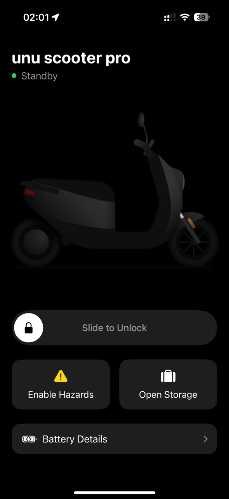

# unu pro (iOS)

An unofficial yet fully native iOS app for controlling unu pro scooters. This project is built with **Swift** and **SwiftUI**, leveraging **CoreBluetooth** for direct BLE (Bluetooth Low Energy) communication.

> **Disclaimer**: This app is not affiliated with or endorsed by unu. Use it at your own risk.

## Motivation

The inspiration behind this project comes entirely from the excellent open-source work of [reunu/tech-reference](https://github.com/reunu/tech-reference) and the Flutter app [reunu/unustasis](https://github.com/reunu/unustasis). While **unustasis** is an impressive accomplishment, I encountered a few reliability issues in practice. Consequently, I decided to build a native Swift alternative to provide a more robust scooter-connection flow.

## Features

1. **Native iOS Integration**  
   - Built in Swift using SwiftUI.

2. **Robust Bluetooth Connection**  
   - Uses CoreBluetooth to scan, connect, and subscribe to relevant GATT services and characteristics.
   - Automatically attempts reconnection if the scooter disconnects unexpectedly.

3. **Lock / Unlock & Handlebar State Detection**  
   - “Slide to Unlock/Lock” gesture in the UI like to original app.
   - Real-time feedback if the scooter’s handlebar fails to lock, and prompts for a retry.

4. **Seat Box Access**  
   - Quickly open the storage compartment with a single tap.

5. **Hazard Lights**  
   - Enables or disables hazard lights directly from the home screen.

6. **Battery Status**  
   - Displays comprehensive battery information: primary, secondary, CBB (Charging Board Battery), and auxiliary.
   - Real-time charging status update (`charging` / `not_charging`).

7. **Hibernation Management**  
   - Automatically wakes the scooter if it’s in hibernation before sending lock/unlock commands.
   - Gracefully handles timeouts and notifies the user if waking fails.

## Architecture Overview

- **`UnuScooterManager`**  
  A dedicated `ObservableObject` class that encapsulates:
  - CoreBluetooth scanning & peripheral management.
  - Discovery of relevant GATT services and characteristics.
  - Reading and writing of characteristic values (lock/unlock, seat, hazards, battery info).
  - Timer-based state checks to ensure a stable connection.

- **SwiftUI Views**:
  - **`ScooterControlsView`**: Main UI for scanning/connection status, the lock/unlock slider, hazard lights, seat action, and a shortcut to battery details.
  - **`BatteryDetailsView`**: Displays a detailed overview of each battery’s current state-of-charge (SoC).

- **Combine & App Lifecycle**:
  - Uses `Combine` to respond to system notifications (`UIApplication.didBecomeActiveNotification`, etc.) to gracefully manage BLE connection state in the background or on app termination.

## Requirements

- **iOS 18.2+**
- **Xcode 16.2+**
- An unu pro scooter with Bluetooth enabled

## Installation & Usage

1. **Clone or Download** the repository.  
2. **Open** the project in Xcode.  
3. **Build** & **Run** on a real iOS device (CoreBluetooth features do not work in the Simulator).  
4. **Grant Bluetooth permissions** upon first launch.  
5. **Scan** for your unu pro scooter within the app.  
6. **Connect** and use the controls to lock/unlock, open seat, enable hazards, and view battery details.

## Roadmap

- **iOS Widgets & Live Activities**: Integrate real-time lock status and battery info on the lock screen or in a widget.
- **Push Notifications**: Notify users if their scooter disconnects or if an action (e.g., locking) fails unexpectedly.

## Contributing

Contributions, bug reports, and feature requests are welcome! Feel free to open an issue or submit a pull request.

## Credits

- **[reunu/tech-reference](https://github.com/reunu/tech-reference)** for the BLE service and characteristic documentation.  
- **[reunu/unustasis](https://github.com/reunu/unustasis)** for the initial scooter communication insights in Flutter.

## License

[GNU General Public License v3.0](LICENSE) – Feel free to modify and distribute under the terms of the GNU General Public License v3.0.

---

**Disclaimer**  
This is an unofficial app. Use it at your own discretion. The author is not responsible for any direct or indirect damage resulting from using this software.
